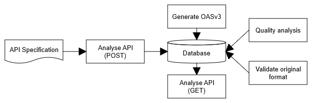

De [OpenAPI Specification (3.x)](https://github.com/OAI/OpenAPI-Specification) is in mei 2018 opgenomen op de [pas toe leg uit lijst](https://www.forumstandaardisatie.nl/standaard/openapi-specification) van Bureau Forum Standaardisatie en daarmee het verplichte formaat om API's van de Nederlandse overheid te beschrijven.

In het kader van het [Kennisplatform API's](https://www.geonovum.nl/themas/kennisplatform-apis) heeft er van december 2018 tot en met februari 2019 een onderzoek plaatsgevonden om de adoptie van deze standaard bij Nederlandse overheids API's in kaart te brengen.

Omdat tijdens het onderzoek al snel bleek dat het moeilijk is om overheids API's te vinden, is er besloten om dit levende document in het leven te roepen waar gaandeweg API's aan toegevoegd kunnen worden die automatisch meegenomen worden in de analyse en de daaropvolgende rapportage.

Nieuwe API's kunnen worden toegevoegd via de [OAS Onderzoek API](https://rebilly.github.io/ReDoc/?url=https://geonovum.github.io/oas-verkenning/assets/openapi.yaml&nocors). Deze API valideert en analyseert bestaande API specificaties, genereert (indien mogelijk) een OASv3 specificatie en kan deze vervolgens toetsen op de mate waarin het API design overeenkomt met de [NL API Strategie](https://docs.geostandaarden.nl/api/API-Strategie/). Meer informatie over hoe de OAS Onderzoek API te gebruiken is, is te vinden in de bijbehorende [API Documentatie](https://rebilly.github.io/ReDoc/?url=https://geonovum.github.io/oas-verkenning/assets/openapi.yaml&nocors). Onderstaande afbeelding geeft het proces weer.




  



## Statistieken per API

Tot nu toe zijn de onderstaande **{{ totalCount }}** API's geanalyseerd, van de volgende **{{ organisations.size }}** verschillende organisatie's: 
{{ organisations | sort | join: ", " }}.

<table>
  <thead>
    <tr>
      <th>Titel</th>
      <th>Formaat</th>
      <th>Errors</th>
      <th>Warnings</th>
      <th>Notices</th>
      <th>OASv3</th>
    </tr>
  </thead>
  <tbody>
    
    
    
    
    
    
    
    
    
    
    
    
      
    
    
      
    
    
      
    
    
      
    
    
      
    
    
      
    
    
      
    
    
      
    
    
      
    
    
      
    
    <tr>
      <td>{{ api.title }}</td>
      <td>{{ api.descriptionFormat }}</td>
      <td>{{ api.inputValidation.errors.size }}</td>
      <td>{{ api.inputValidation.warnings.size }}</td>
      <td>{{ api.inputValidation.notices.size }}</td>
      <td><a href="{{ api._links.openapiYaml.href }}">YAML</a> - <a href="{{ api._links.openapiJson.href }}">JSON</a></td>
    </tr>
    
  </tbody>
</table>

## Algemene validatie statistieken

|Errors|Warnings|Notices|Valid|
|-|-|-|-|-|
|{{ errors }} ({{ errors | times: 1.0 | divided_by: totalCount | times: 100 | round: 0 }}%)|{{ warnings }} ({{ warnings | times: 1.0 | divided_by: totalCount | times: 100 | round: 0 }}%)|{{ notices }} ({{ notices | times: 1.0 | divided_by: totalCount | times: 100 | round: 0 }}%)|{{ valid }} ({{ valid | times: 1.0 | divided_by: totalCount | times: 100 | round: 0 }}%)|

## Gebruikte API specificatie standaard

|API Blueprint|RAML|Swagger|OpenAPI 3|Postman|Async API|
|-|-|-|-|-|-|-|
|{{ api_blueprint }} ({{ api_blueprint | times: 1.0 | divided_by: totalCount | times: 100 | round: 0 }}%)|{{ raml }} ({{ raml | times: 1.0 | divided_by: totalCount | times: 100 | round: 0 }}%)|{{ swagger }} ({{ swagger | times: 1.0 | divided_by: totalCount | times: 100 | round: 0 }}%)|{{ openapi_3 }} ({{ openapi_3 | times: 1.0 | divided_by: totalCount | times: 100 | round: 0 }}%)|{{ postman }} ({{ postman | times: 1.0 | divided_by: totalCount | times: 100 | round: 0 }}%)|{{ asyncapi_1 }} ({{ asyncapi_1 | times: 1.0 | divided_by: totalCount | times: 100 | round: 0 }}%)