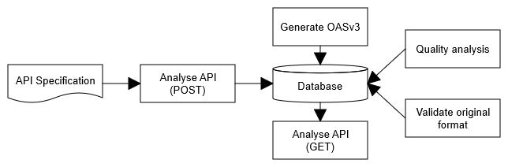

## Analyse Tool

De resultaten van het [rapport](rapport.html) worden geautomatiseerd bijgewerkt door de Analyse Tool. Om deze tool een API Specificatie te laten analyseren kan er, via onze [Analyse API](docs.html), een link naar de API specificatie verzonden worden. Hieronder wordt het hele proces stap voor stap beschreven:

1. De locatie van de oorspronkelijke API Specificatie wordt, samen met aanvullende informatie, via een `POST` request naar de Analyse API gestuurd. Momenteel worden de volgende API Specificatie formaten ondersteund:
   - [API Blueprint](https://apiblueprint.org/documentation/specification.html)
   - [RAML](https://github.com/raml-org/raml-spec/blob/master/versions/raml-10/raml-10.md)
   - [Postman](https://schema.getpostman.com/json/collection/v2.0.0/docs/index.html)
   - [AsyncAPI 1.x](https://www.asyncapi.com/docs/specifications/1.2.0/)
   - [Swagger 1.x](https://github.com/OAI/OpenAPI-Specification/blob/master/versions/1.2.md)
   - [Swagger 2.x](https://github.com/OAI/OpenAPI-Specification/blob/master/versions/2.0.md)
   - [Open API 3.x](https://github.com/OAI/OpenAPI-Specification/blob/master/versions/3.0.2.md)
2. Indien de call succesvol is, wordt er een `201 Created` geretourneerd. Dit wil zeggen dat het verzoek succesvol door de Analyse API is ontvangen en dat de Analyse Tool aan de slag gaat.
3. De oorspronkelijke API Specificatie wordt opgehaald en, indien succesvol, opgeslagen in de database. Als het bestand niet opgehaald kan worden wordt er een error genoteerd en wordt het proces afgebroken.
4. De Analyse Tool detecteert het oorsponkelijke formaat van de API Specificatie en slaat deze op in de database.
5. De oorspronkelijke API Specificatie wordt gevalideerd op geldigheid. Indien er fouten zitten in de oorsponkelijke API Specificatie kan de Analyse Tool niet verder met analyseren en wordt het proces afgebroken.
6. Indien de oorspronkelijke API Specificatie geldig is wordt deze door [Apimatic](https://www.apimatic.io/) automatisch omgezet naar het `OpenAPI 3.x (OASv3)` formaat. Het resultaat hiervan wordt opgeslagen in zowel `JSON` (makkelijk voor machines) als `YAML` (makkelijk voor mensen) formaat.
7. Nu de specificatie beschikbaar is in `OASv3` formaat kan de Analyse Tool gebruik maken van geavanceerde OpenAPI tooling zoals [Speccy](http://speccy.io/) om diepgaande kwaliteitscontroles uit te voeren. Op dit moment worden enkel de standaard geregels gechecked, dit kan later uitgebreid worden met meerdere regels zoals bijvoorbeeld de guidelines van de Nederlandse API Strategie. De resultaten van deze checks worden opgeslagen in de database.
8. Alle resultaten worden ontsloten via een `GET` request op de Analyse API.

## Errors, warnings en notices

De Analyse Tool maakt een onderscheid tussen errors (fouten), warnings (waarschuwingen) en notices (notificaties). Een API Specificatie is alleen 'invalid' (ongeldig) op het moment dat er een error ontdekt wordt. Idealiter bevat een API Specificatie geen enkele error, warning of notice, maar het is wel belangrijk om verschillende niveau's te erkennen.

### Error

Een error treedt op als de API Specificatie invalid is en de Analyse Tool het proces niet kan afmaken. Dit is bijvoorbeeld het geval als de Analyse Tool het bestand niet kan ophalen of als het bestand niet gelezen kan worden door fouten in de syntax. Een error móet verholpen worden om te kunnen garanderen dat machines (zoals de Analyse Tool of tools die documentatie genereren) de API Specificatie kunnen interpreteren.

### Warning

Een warning treedt op als de Analyse Tool de API Specificatie wel kan laden, lezen en interpreteren, maar er bepaalde cruciale informatie ontbreekt dat mogelijk voor problemen bij andere tools kan zorgen omdat het afwijkt van de standaard. Een voorbeeld van een warning is dat er wel een `version` is opgenomen, maar dat het corresponderende versienummer niet conform het [SemVer](https://semver.org/) formaat is. Voorbeeld: `version: 'blabla'` in plaats van `version: '1.0.2'`.

### Notice

Een notice wordt geregistreerd als de API Specificatie technisch in orde en volledig door machines te begrijpen is, maar bepaalde informatie niet voldoet aan best practices voor de bruikbaarheid in de praktijk. Een voorbeeld hiervan is het ontbreken van omschrijvingen bij velden.